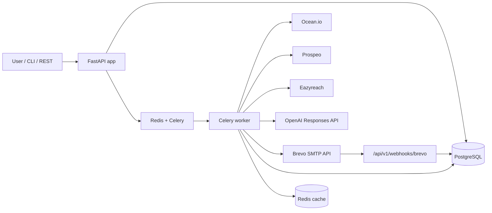

# Automated Outreach Pipeline

Production-ready FastAPI and Typer service for automated B2B outreach.

Input a company domain such as `openai.com`. The system finds similar companies with Ocean.io, finds decision makers with Prospeo, resolves verified emails with Eazyreach, generates short personalized emails with OpenAI, sends through Brevo after approval, and tracks everything in PostgreSQL.

## Live Links

- Production API: https://automated-outreach-pipeline.vercel.app
- Swagger docs: https://automated-outreach-pipeline.vercel.app/docs
- Health check: https://automated-outreach-pipeline.vercel.app/health
- GitHub repository: https://github.com/sm5963397-sjm/automated-outreach-pipeline
- Final deployment report: `docs/Automated_Outreach_Pipeline_Final_Deployment_Report.pdf`

The Vercel deployment is a serverless API/docs deployment. Full campaign execution still requires production PostgreSQL, Redis/Celery worker hosting, provider API keys, and Brevo sender-domain configuration.

## Architecture



## Workflow

1. `POST /api/v1/pipeline/start` creates a campaign and queues discovery.
2. Ocean.io returns similar companies.
3. Prospeo returns decision makers filtered to Founder, CEO, CTO, VP Engineering, Head of Engineering, and Director of Engineering.
4. Eazyreach resolves emails from LinkedIn profiles. Only verified emails are stored.
5. OpenAI generates a subject and body for each verified contact.
6. Campaign status becomes `AWAITING_APPROVAL`.
7. CLI asks `Proceed?`; REST clients call `POST /api/v1/pipeline/{id}/send`.
8. Brevo sends emails and statuses are tracked as `PENDING`, `SENT`, `FAILED`, or `BOUNCED`.

## Setup

```powershell
cd outreach-pipeline
python -m venv .venv
.\.venv\Scripts\Activate.ps1
pip install -r requirements.txt
Copy-Item .env.example .env
```

Edit `.env` and set provider keys:

| Variable | Purpose |
| --- | --- |
| `DATABASE_URL` | PostgreSQL SQLAlchemy URL |
| `REDIS_URL` | Redis cache URL |
| `CELERY_BROKER_URL` | Celery Redis broker |
| `CELERY_RESULT_BACKEND` | Celery result backend |
| `APP_API_KEY` | Optional API key required via `X-API-Key` |
| `OCEAN_API_KEY` | Ocean.io API key |
| `PROSPEO_API_KEY` | Prospeo API key |
| `EAZYREACH_API_KEY` | Eazyreach API key |
| `EAZYREACH_EMAIL_LOOKUP_PATH` | Configurable Eazyreach lookup path |
| `OPENAI_API_KEY` | OpenAI API key |
| `OPENAI_MODEL` | Model for email generation |
| `BREVO_API_KEY` | Brevo API key |
| `BREVO_SENDER_EMAIL` | Sender address |
| `BREVO_SENDER_NAME` | Sender display name |

## Run Locally

Start PostgreSQL and Redis, then run migrations:

```powershell
alembic upgrade head
```

Start the API:

```powershell
uvicorn app.main:app --reload
```

Start the worker in a second terminal:

```powershell
celery -A app.tasks.celery_app worker --loglevel=info
```

Run the CLI:

```powershell
outreach start openai.com
outreach status <campaign-id>
```

## Docker

```powershell
Copy-Item .env.example .env
docker compose up --build
```

Services:

- `app`: FastAPI API, runs Alembic migrations on startup.
- `worker`: Celery worker for pipeline execution.
- `postgres`: PostgreSQL 16.
- `redis`: Redis cache and Celery broker.

API docs are available at:

- `http://localhost:8000/docs`
- `http://localhost:8000/redoc`

## API

Start discovery:

```http
POST /api/v1/pipeline/start
Content-Type: application/json

{
  "domain": "openai.com"
}
```

Optional automatic send after discovery:

```json
{
  "domain": "openai.com",
  "auto_send": true
}
```

Get status:

```http
GET /api/v1/pipeline/{campaign_id}
```

Approve sending:

```http
POST /api/v1/pipeline/{campaign_id}/send
```

List records:

```http
GET /api/v1/companies
GET /api/v1/contacts
GET /api/v1/campaigns
GET /api/v1/emails
```

Brevo bounce webhook:

```http
POST /api/v1/webhooks/brevo
```

## Reliability

- External API retries: 3 retries with exponential backoff of 1s, 2s, and 4s.
- Rate limits: HTTP `429` responses retry automatically and respect `Retry-After`.
- Circuit breaker: each provider opens after repeated failures and recovers after the configured cooldown.
- Redis caching: Ocean, Prospeo, and Eazyreach lookups are cached to reduce spend and rate-limit pressure.
- Structured logs: JSON logs go to stdout and `logs/app.log`.

## Database

Tables:

- `companies`: company profile and domain.
- `contacts`: decision makers and verified email status.
- `campaigns`: source domain, status, summary, and error state.
- `emails`: generated messages and send lifecycle.

Migrations live in `migrations/`. Apply them with:

```powershell
alembic upgrade head
```

## Testing And Quality

```powershell
pytest
ruff check .
black --check .
mypy app
```

Current local verification:

- `19 passed`
- `86.20%` coverage
- Ruff clean
- Black clean
- Mypy clean for application code

## Deployment Guide

1. Use managed PostgreSQL and Redis in production.
2. Store provider keys in your secret manager and inject them as environment variables.
3. Run `alembic upgrade head` during release.
4. Run at least one API replica and one Celery worker replica.
5. Scale workers independently for larger campaigns.
6. Configure Brevo webhooks to call `/api/v1/webhooks/brevo`.
7. Set `APP_API_KEY` or place the app behind an authenticated gateway.
8. Ship JSON logs from stdout or `logs/app.log` to your log platform.
9. Monitor `/health`, Celery worker health, queue depth, provider error rate, and bounce rate.

## Provider Notes

The adapters isolate provider-specific payloads and normalize responses into internal DTOs. Ocean defaults to `POST /search/companies`, Prospeo defaults to `POST /search-person`, Brevo defaults to `POST /smtp/email`, and Eazyreach is configurable through `EAZYREACH_EMAIL_LOOKUP_PATH` because email-enrichment API paths vary by account/version.
